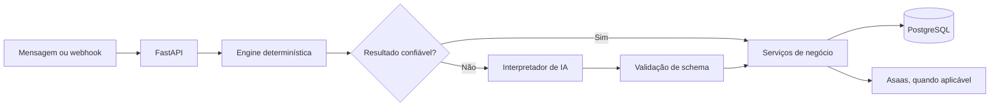

# BR Organiza

## Contexto

O BR Organiza é uma aplicação de organização financeira operada por mensagens. O código atual combina uma API FastAPI, regras determinísticas, persistência em PostgreSQL e integrações externas opcionais. Esta apresentação se baseia na implementação e nos testes presentes no repositório privado; não declara estado de produção.

## Funcionalidades verificadas

- API em FastAPI para receber e processar eventos.
- Registro, consulta, correção e exclusão lógica de lançamentos financeiros, com confirmação para operações sensíveis.
- Idempotência de mensagens, estado multi-turno e trilha de auditoria.
- PostgreSQL com migrations para dados, pendências, outbox, pagamentos e telemetria de chamadas de IA.
- Cliente de pagamentos Asaas, com tratamento de confirmação e conciliação.
- Testes para API HTTP, banco, pagamentos, IA, autorização e fluxos de negócio.

## Stack e camadas

| Camada | Tecnologias e responsabilidades verificadas |
| --- | --- |
| Interface HTTP | Python e FastAPI |
| Domínio | regras de intenção, datas, valores, confirmações e recorrência |
| Aplicação | serviços de webhook, ledger, agenda, pagamentos e fallback de IA |
| Dados | PostgreSQL, `psycopg` e migrations SQL |
| Integrações | HTTP para OpenAI/Anthropic e cliente Asaas |
| Qualidade | testes automatizados em Python |

## IA integrada à aplicação

O interpretador de IA chama OpenAI ou Anthropic por HTTP quando o fluxo determinístico não resolve a mensagem com segurança. O contrato exige uma resposta JSON e a aplicação valida campos permitidos, intenções, confiança e dados antes de transformá-la em resultado de domínio.

Falhas de rede, schema inválido ou IA desabilitada produzem um resultado seguro e o fluxo permanece nas regras da aplicação. O contexto enviado ao provedor é reduzido e explicitamente permitido; identificadores e histórico financeiro não fazem parte desse contrato de prompt.

Não há function calling: a IA apenas interpreta e devolve dados estruturados. Não foram verificadas implementações de RAG, embeddings ou agentes, por isso esses termos não são usados como capacidades do projeto.

## Decisões técnicas relevantes

- Regras determinísticas assumem o caminho principal; IA entra como fallback, não como executor.
- Confirmação e auditoria protegem correções, exclusões e outras operações persistentes.
- Escrita de negócio e auditoria são tratadas na mesma transação quando aplicável.
- Integrações de pagamento são isoladas em cliente próprio e cobertas por testes de confirmação e conciliação.

O README do projeto privado contém referências históricas que não representam todo o estado atual. Esta apresentação usa a estrutura e os testes presentes no código como fonte para as características listadas acima.
