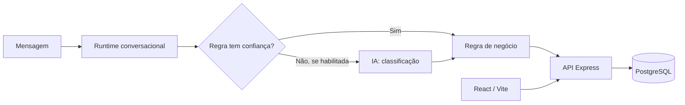

# BRWhats Platform

## Contexto

O BRWhats Platform é uma plataforma SaaS multi-tenant voltada a fluxos de atendimento comercial por mensagens. A implementação analisada reúne uma API, painel web, persistência relacional e um runtime conversacional. Esta apresentação descreve apenas características técnicas verificadas no repositório privado; não inclui código, dados ou configuração operacional.

## Funcionalidades verificadas

- API HTTP com autenticação e rotas de negócio para operações como leads, agenda, catálogo, equipe, relatórios e integrações.
- Painel web para operação desses fluxos.
- Persistência em PostgreSQL, com migrations e acesso por pool.
- Runtime conversacional com sessão persistente, regras determinísticas, follow-ups e validação de mídia.
- Suítes de teste para API, bot e regras de negócio.
- Ambiente demonstrativo isolado, com dados fictícios e tenant reservado para demonstração.

## Stack e organização

| Camada | Tecnologias verificadas |
| --- | --- |
| API | Node.js, TypeScript e Express |
| Web | React e Vite |
| Dados | PostgreSQL e migrations SQL |
| Runtime conversacional | Node.js/TypeScript, regras e armazenamento de sessão |
| Qualidade | testes com `node --test` e checagem TypeScript |

O código separa rotas HTTP, acesso a dados, serviços e regras do runtime. No bot, a intenção determinística é avaliada antes da IA; ações e respostas de negócio continuam submetidas às regras e à configuração do tenant.

## IA integrada à aplicação

Há integração HTTP com a API da Anthropic para classificação quando a regra não resolve a mensagem com confiança suficiente. A resposta é interpretada como uma classificação limitada; a IA não recebe a responsabilidade de executar ações críticas. Também há código para resumo de lead com Anthropic e fluxos de mídia com extração estruturada.

A demonstração analisada é deliberadamente isolada: sua documentação informa que IA, áudio e integrações externas ficam desligados por padrão. Portanto, ela demonstra arquitetura e fluxo determinístico, e não é apresentada como prova de IA ativa.

Não foram incluídas alegações de RAG, embeddings, agentes ou function calling porque essas implementações não foram verificadas como parte desta apresentação.

## Decisões técnicas relevantes

- Priorizar regras determinísticas para respostas previsíveis e acionar IA apenas quando necessário.
- Manter configuração e capacidades por tenant fora do núcleo de regras.
- Falhar de forma explícita quando uma integração ou configuração essencial estiver ausente.
- Manter uma demo com dados fictícios e integrações desligadas para reduzir risco de exposição operacional.
